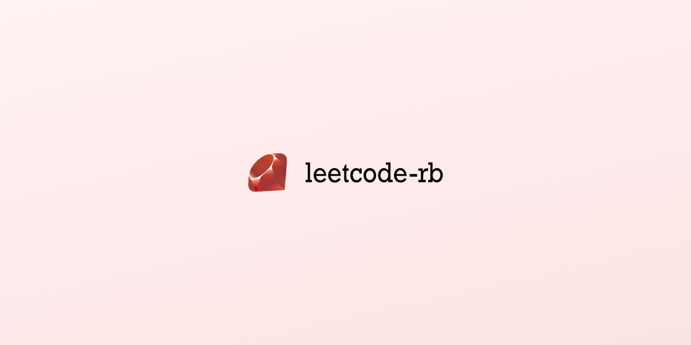

# LeetCode Solutions in Ruby


About This repo is the Ruby counterpart of the leetcode-js. Each problem's solution is organized by difficulty. Resources

Feel free to ask if you need any more help!

## Table of Contents

- [Installation](#installation)
- [Usage](#usage)
- [Problems Solved](https://github.com/arjunkdot/leetcode-rb/)
  - [Easy](https://github.com/arjunkdot/leetcode-rb/tree/main/easy/)
  - [Medium](https://github.com/arjunkdot/leetcode-rb/tree/main/medium/)
  - [Hard](https://github.com/arjunkdot/leetcode-rb/tree/main/hard/)
- [License](#license)

## Installation

1. Clone the repository:

```bash
git clone https://github.com/arjunkdot/leetcode-rb.git
```

## Usage

You can execute the Ruby solutions as follows:

```bash
ruby easy/01-sum-of-unique-elements/solution.rb
```

## License

THE SOFTWARE IS PROVIDED “AS IS”, WITHOUT WARRANTY OF ANY KIND, EXPRESS OR IMPLIED, INCLUDING BUT NOT LIMITED TO THE WARRANTIES OF MERCHANTABILITY, FITNESS FOR A PARTICULAR PURPOSE AND NONINFRINGEMENT. IN NO EVENT SHALL THE AUTHORS OR COPYRIGHT HOLDERS BE LIABLE FOR ANY CLAIM, DAMAGES OR OTHER LIABILITY, WHETHER IN AN ACTION OF CONTRACT, TORT OR OTHERWISE, ARISING FROM, OUT OF OR IN CONNECTION WITH THE SOFTWARE OR THE USE OR OTHER DEALINGS IN THE SOFTWARE.
